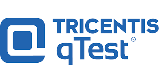

# NeoLoad Qtest Integration
<p align="center"></p>

This project is aimed to integrate NeoLoad into Qtest
This project has 2 disctinct components :
* `QtestContext` : Custom action that will share the Project Context with NeoLoad Web.
* `WebhookHandler` : Service that will receive the NeoLoad Web Test end notification ( through WebHook)
## QtestContext
This custom action will allow you to add all the project information required in XRAY :
   * `ProjectId` (Required) : Project id in Qtest
 

QtestContext will update the test results in NeoLoad web with all the information required to be able to import a NeoLoad web test results in Qtest

     
| Property | Value |
| -----| -------------- |
| Maturity | Experimental |
| Author   | Neotys Partner Team |
| License  | [BSD Simplified](https://www.neotys.com/documents/legal/bsd-neotys.txt) |
| NeoLoad  | 7.6 (Enterprise or Professional Edition w/ Integration & Advanced Usage and NeoLoad Web option required)|
| Requirements | NeoLoad Web |
| Bundled in NeoLoad | No
| Download Binaries | <ul><li>[latest release]() is only compatible with NeoLoad from version 7.6</li></ul>|

### Installation

1. Download the [latest release]() for NeoLoad from version 7.6
1. Read the NeoLoad documentation to see [How to install a custom Advanced Action](https://www.neotys.com/documents/doc/neoload/latest/en/html/#25928.htm).

<p align="center"></p>

### NeoLoad Set-up

Once installed, how to use in a given NeoLoad project:

1. Create a `QtestContext` User Path.
1. Insert `QtestContext` in the `Action` block.
1. Create a `QtestContext` User Path.
1. Insert `QtestContext` in the `Action` block.
<p align="center"></p>


1. Create a NeoLoad Population Qtest having only the userPath QtestContext
<p align="center"></p>
1. Create a NeoLoad Scenario Using your population and the Qtest Population
The Qtest Population would need to be added to your NeoLoad scenario with the following settings :
* Duration : iteration
* Load Policy : Constant : 1 user doing 1 iteration
<p align="center"></p>

### Parameters for QtestContext
   
| Name             | Description |
| -----            | ----- |
| `ProjectName`      | Identifier of your project name in Qtest |
| `TestCycle`      | Identifier of your existing test cycle ( needs to exist in your qtest project |
| `ReleaseName`      | Identifier of your release name ( needs to exists in your qtest projedct)  |
| `EnableDefectCreation`      | Optionnal - Default Value false. This property will automatically create defect if one of the NeoLoad SLA has failed |


## WebHook Handler

### Configuration
The webhook handler is a web service package in a container : `neotyspartnersolution/neoload_qtestresultsync`
The container will required different type of Environment variables to connect the service to Qtest and NeoLoad Web

To be able to import NeoLoad test results you will need to specify :
* `NL_WEB_HOST`: Hostname of the webui of NeoLoad WEB
* `NL_API_HOST` : Hostname of the rest-api of NeoLoad WEB
* `NL_API_TOKEN` : API token of NeoLoad WEB ( [how to generate an API token](https://www.neotys.com/documents/doc/nlweb/latest/en/html/#24270.htm))
* `PORT`  : Port that the service will listen to
* `ssl` : True or False. It would define how to interact with the Apis
* `logging-level` : Logging level of the service ( DEBUG, INFO, ERROR)
* `QTestApiHost` : Hostname of the Qtes Environment
* `QTestApiPort` : Port of the Qtest environment
* `QtestAPiPath` : Relative path to the qtest api (default : /api)
* `QtestAPIToken` : Api token to use Qtest Apis

#### Run the webhookHandler

Requirements : Server having :
* docker installed
* acessible from NeoLoad WEB ( Saas our your managemend instance of NeoLoad WEB)
* able to interact with  NeoLoad Web APi and Qtest API

THe deployment will use either :
* `/deploy/docker-compose.yaml` 

Make sure to update the docker-compose file by specifying the Environment variables.

the deployment will be done by running the following command :
```bash
docker-compose -f <docker file> up -d
```
#### Configure the WebHook in your NeoLoad Web Account to send a notification to your WebHook service

The webhookhandler service is listenning to 2 disctinct endpoints :
* `/health` : Get request build to check if the webhookhandler is up
* `/webhookend` : POST request to receive the webhook from NeoLoad WEB

The Webhookhandler is expecting the following Json Payload :
```json
{
	"testid" : "TESTID",
	"workspaceid":"WORKSPACEID"
}
```

To configure the webhook in NeoLoad WEB you will need to :
1. Connect to NeoLoad WEB
2. Click on 
3. Click On the TAB named WebHook
4. Create a new Webhook ( [How to create a webhook](https://www.neotys.com/documents/doc/nlweb/latest/en/html/#27141.htm))
5. URL of the webhook : http://<IP of you WEBHOOKHANDLER>:8080/webhookend
6. Events : Test ended
7. Payload :
```json
{
  "workspaceid" : "$(workspace_id)",
  "testid": "$(test_result_id)"
}
```
<p align="center"></p>

## What would be created in Qtest

The qtest integration will automatically create the following things in your Qtest project , Release, Test Cycle :

### Test case and test case detail
After the test execution the integration will create the test case with the name of your :
- neoload project
- neoload scenario
<p align="center"></p>

### Test execution result
<p align="center"></p>


### Defects ( if the EnableDefectCreation ( QtestContext ) is enabled)
<p align="center"></p>

The integration will generate a image (.png) of each SLA that has failed during the test.
This image will be added as an attachment in the defect to illustrate the issue :
<p align="center"></p>
